# Sift

Sift is a free, lightweight, open-source app for **culling photos on macOS**.
Open a folder, move through it with the arrow keys, and keep, reject, favorite,
rotate, crop or delete each frame without reaching for the mouse.

<table>
<tr>
<td width="50%" valign="top">

**Folder view (replaces Finder)**

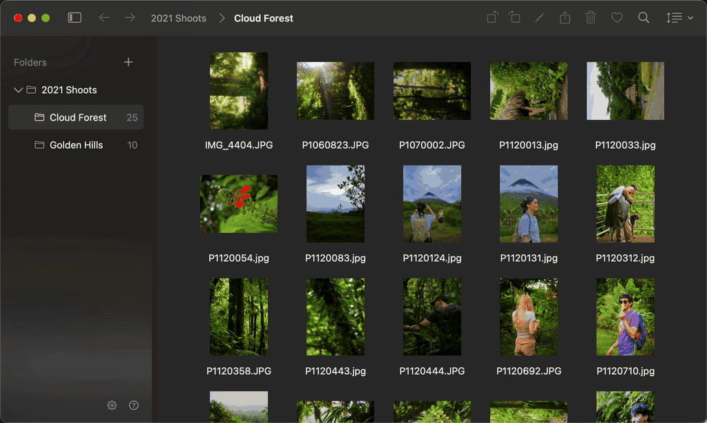

</td>
<td width="50%" valign="top">

**Image view (replaces Preview)**

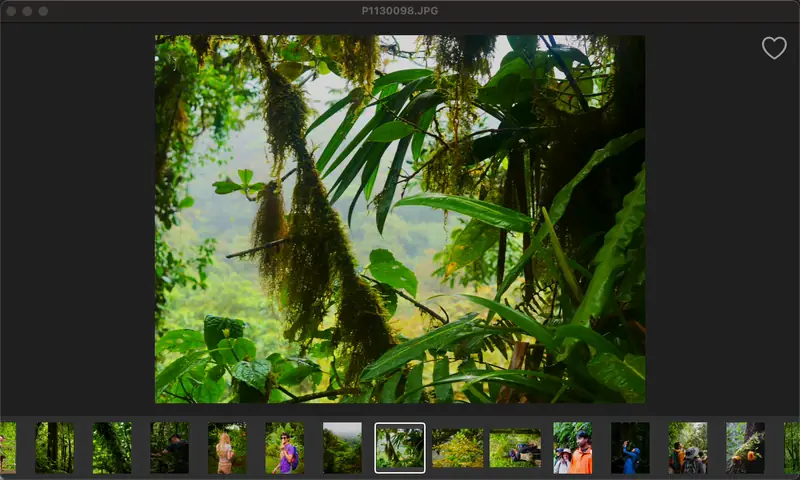

</td>
</tr>
</table>

## Install

Requires macOS 15 or later, on Apple Silicon.

[](https://github.com/nhilikeknee/sift/releases/latest)

Open the `.dmg` and drag Sift to Applications.

<picture>
  <source media="(prefers-color-scheme: dark)" srcset="docs/install-dark.gif">
  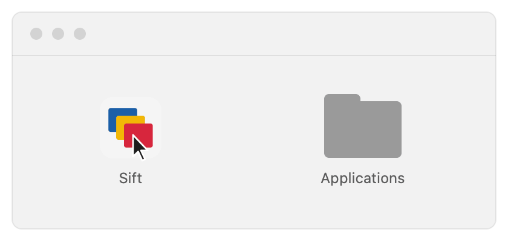
</picture>

The first time you open it, macOS will alert once that it cannot check the app
for malware. Sift is not signed by a paid Apple developer account (I'm not
paying for that). Letting it through takes three steps, once:

1. Double-click Sift, then dismiss the warning.
2. Open System Settings > Privacy & Security and scroll to the bottom.
3. Press **Open Anyway** on the line naming Sift, and confirm.

Done!

If clicking past a malware warning is not something you want to do, build it
from source instead.

### Build from source

You need Xcode's command line tools (`xcode-select --install` if you have never
installed them).

```bash
git clone https://github.com/nhilikeknee/sift.git
```

```bash
cd sift && make run
```

That builds the app and puts it in `~/Applications/Sift.app`. After the first
build, open it like any other
app: from Launchpad, from Spotlight, or by dragging it to the Dock. If
Launchpad does not show it straight away, `killall Dock` makes it look again.

## The keys

Press `?` in the app for all keyboard shortcuts.

| | |
|---|---|
| Move | `←` `→` a photo, `↑` `↓` a row, `⌘⇧→` `⌘⇧←` the folder beside this one |
| Look | Return opens the preview beside the grid and both share one cursor, Esc closes it, `z` zooms to 1:1, `i` shows the file's facts |
| Compare | `a` marks a frame as A, `\` flips to it, `\|` puts the two side by side |
| Decide | `p` keep, `x` reject, `⇧X` review the rejects, `.` favorite, `1`–`5` color labels |
| Act | `d` to the Trash, `m` move, `n` rename, `[` `]` rotate, `c` crop, `⇧A` adjust |
| Save an edit | Return writes a copy beside the photograph, `⇧Return` writes into it and keeps the original aside |
| Undo | `⌘Z` |

Commands can be changed and toggled on/off in Settings.

## More features for power users

### Two passes

<table>
<tr>
<td width="50%" valign="top">

**The first pass**

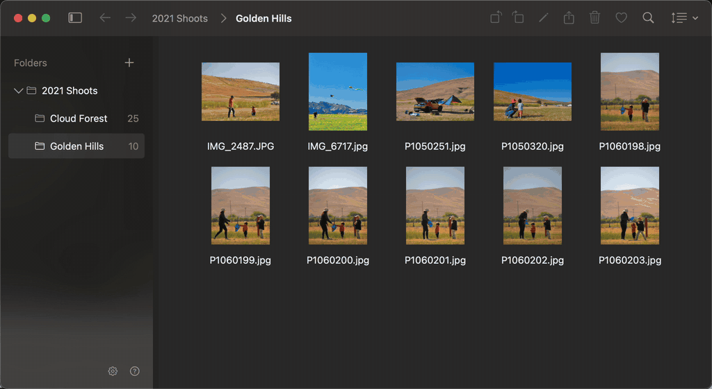

Mark your Rejects and Accepted photos in one quick initial run (nothing deleted
yet).

</td>
<td width="50%" valign="top">

**The second pass**

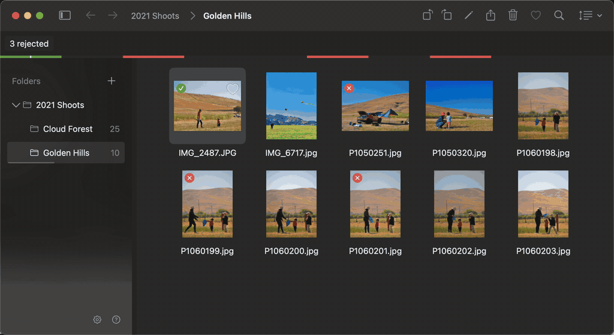

Review Rejects before confirming deletion.

</td>
</tr>
</table>

### Peek at a photo without opening it

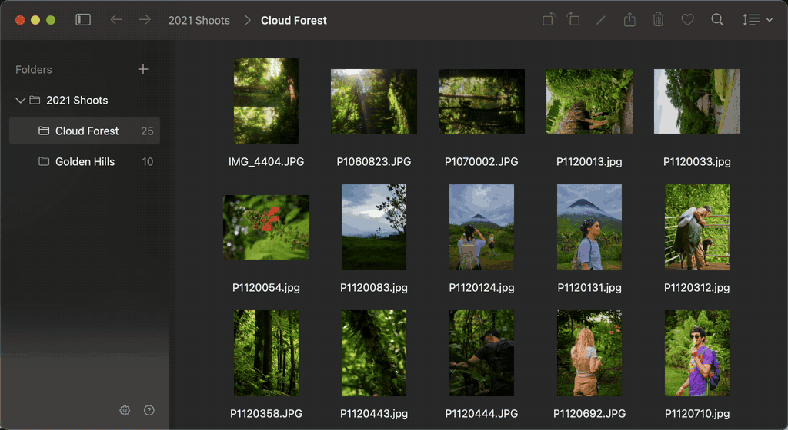

Hold **Option** and hover a thumbnail for a quick look, without opening a second
window.

### Skim a whole shoot

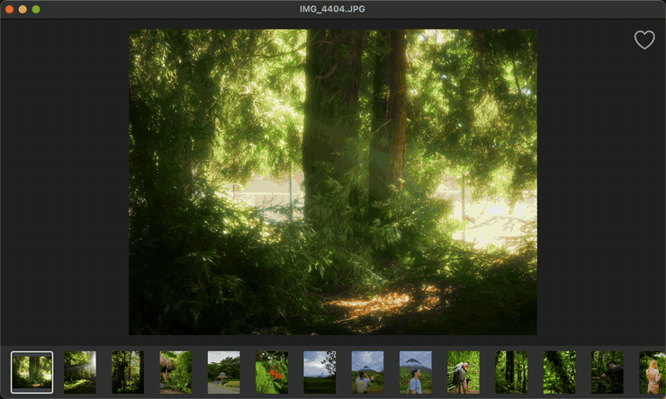

Twenty-five full-size frames in seven seconds, each one read off the disk as
the arrow key lands. Nothing is imported first and no previews are built.

### Zoom once and every frame lands in the same place

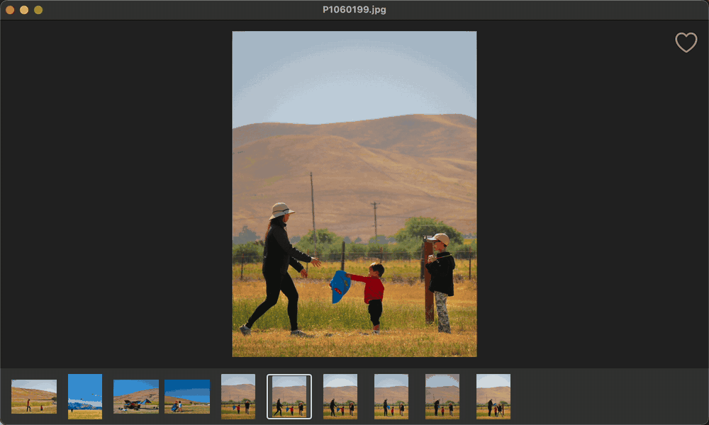

### Hold two frames against each other

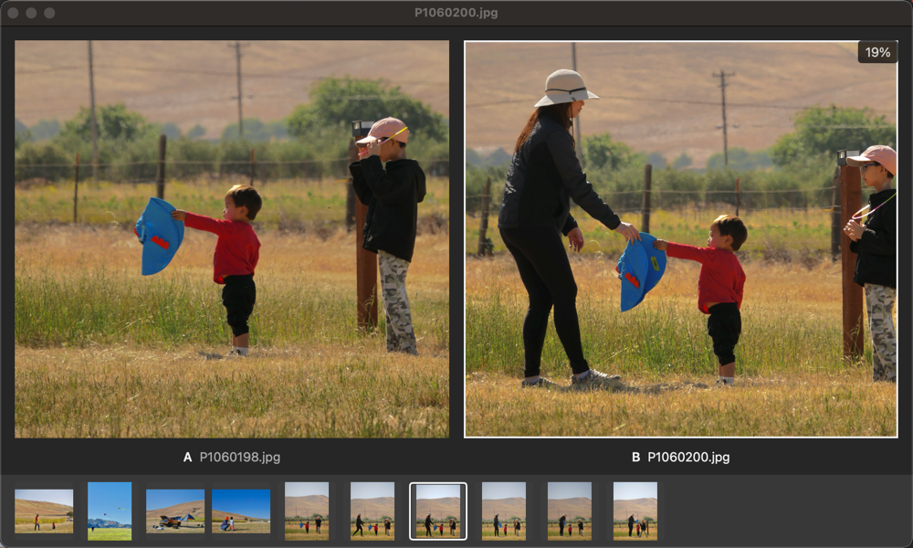

### Image info details

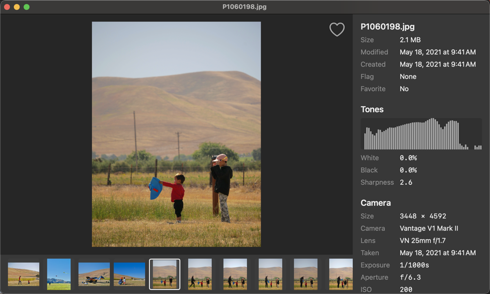

### Adjust light and color

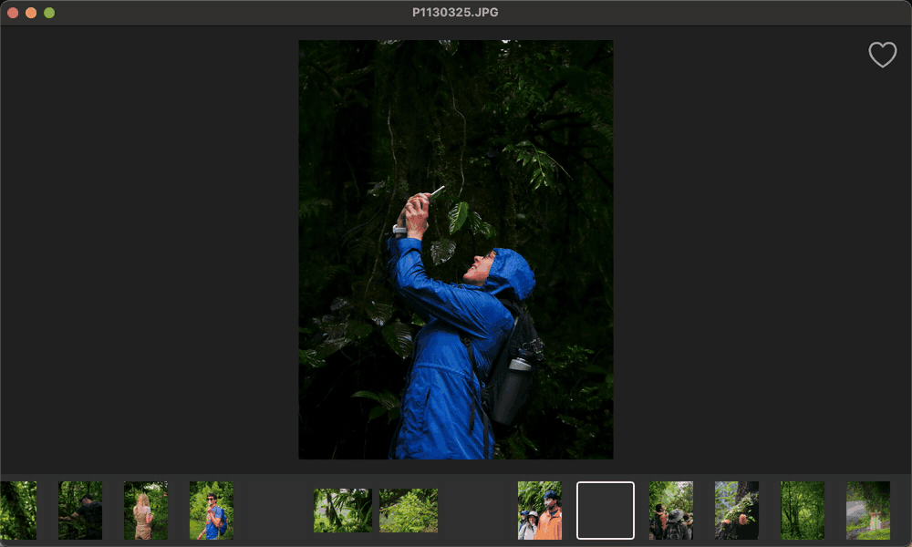

## What it does with your files

There is no catalog and no database: the folder is the app's only store. Flags,
favorites and color labels are Finder tags, written where Finder and Spotlight
read them. Deleting moves to the Trash. Every change can be taken back with
`⌘Z`.

It opens JPEG, PNG, HEIC, HEIF, TIFF, GIF, WebP and BMP.

Turn on **Write XMP Sidecars** in the File menu and it also writes a `.xmp`
beside each photograph, which is what Lightroom and Bridge read. It is off by
default, because writing a new file into the shoot is your call, and a sidecar
another application wrote is edited rather than replaced.

Two things write into a photograph: **Save changes** in the crop bar and in the
adjust panel. Each keeps the frame as it arrived in a hidden file beside it, so
`DSC_0001.jpg` gets `.DSC_0001.sift-original.jpg` and **Revert** puts it back
weeks later. That file stays until you delete the photograph in Sift, which
takes it along, and it follows a move or a rename. If a move cannot carry it,
the move still happens and the kept original stays in the folder the photograph
left, so a folder you have emptied can hold one hidden full-size frame.

## Privacy

No network code: no `URLSession` in the source, no analytics, no crash
reporting, no update check. Sift sends nothing anywhere on its own. Face
detection is Apple's on-device Vision.

The one way a photograph leaves is one you press. **Copy Image** (`⌃⌘C`) puts
the frame's own bytes on the clipboard, so the app you paste into decodes the
file itself and the EXIF goes with it, GPS included. macOS carries the
clipboard to your other devices when Handoff is on.

The only things written outside the folder you are working in are preferences
in Sift's own container under `~/Library/Containers`, and undo backups in a
private temporary directory, mode 0700 under a name nothing can guess. Quitting
deletes the backups. A crash or a force quit never reaches that, so the next
launch sweeps what the last one left: each directory says which process made it,
and one whose process has gone is taken away.

Sift runs in the App Sandbox, so it starts with no reach at all. It reads a
folder only after you hand it one: pick it in the open panel, drop it on the
window, or open it from the Finder. Each one is kept so the next launch can read
it again, and **Settings > Folders** lists every folder Sift can reach right now.

**Remove** on a row drops that folder. That takes the access away rather than
only forgetting the path, so the folder is unreadable to Sift afterwards,
unless a folder above it is on the list too: a grant reaches everything under
it, and removing the shoot inside a card you also handed over leaves the card
holding it. **Remove All** clears the lot. macOS's own switches still cover Desktop,
Documents, Downloads and removable volumes, which is a wider fence than this one
and not the same fence. **Open Privacy & Security** goes to them.

## Photo culling, and what this replaces

Is this the app you are looking for? Sift is a **photo culling app for
macOS**, free and open source under the MIT license, with no account and no
subscription. You point it at a folder of photos and decide, frame by frame,
what stays, from the keyboard rather than with the mouse.

The two-pass cull is the reason it exists. The first pass is yes or no: `p`
keeps, `x` rejects, the cursor moves on by itself, and nothing is moved or
deleted. The second pass is `⇧X`, which puts every rejected frame on one screen
and asks again. Take back the ones you were wrong about, then move the rest to
a folder or to the Trash in one action, with one undo. The reject key never
deletes anything on its own, which is the point of splitting the work in two.

Where it sits on a crowded shelf:

- **Photo Mechanic, FastRawViewer.** The same shape of tool for the same
  reason, and the ones most people mean by photo culling software. Sift **does
  not read RAW files**, which is most of the job for both of those, so if you
  shoot RAW this is not a replacement today. Reading them is the next thing on
  the list, under [Upcoming features](#upcoming-features).
- **Lightroom, Capture One.** Those import into a catalog and develop. Sift has
  ten sliders and no catalog, and it works on the files where they already sit
  rather than taking them somewhere first.
- **Apple Photos.** A library that takes ownership of your photographs. Sift
  never moves anything you did not ask it to move, and the flags and labels it
  writes are Finder tags that other apps can read.
- **Preview and Finder.** The two it replaces. Preview opens one photo and
  forgets the folder it came from; Finder's gallery shows the folder but cannot
  show a photo well.

The requirements again, because they rule a lot of people out: macOS 15 or
later and Apple Silicon. Download the `.dmg`, or build it from source.

## Upcoming features

**RAW files.** CR2, CR3, NEF, ARW, DNG and the rest, for viewing and culling.
macOS decodes every one of them already, so nothing joins the build. The work
is in what a RAW cannot do: it cannot be written back, so rotate, crop and
adjust will offer a copy rather than touch the original, and a camera set to
RAW+JPEG will read as one photograph rather than two cells.

**More adjustments.** Clarity, Texture and Dehaze, for seeing what is in a
frame before deciding about it. Curves, HSL and color grading stay out: those
change how a kept frame looks, which is a different app.

## FAQ

**Does Sift read RAW files?**
Not yet. It opens JPEG, PNG, HEIC, HEIF, TIFF, GIF, WebP and BMP today. RAW is
the next thing on the list, under [Upcoming features](#upcoming-features). If
you shoot RAW and need it now, Photo Mechanic and FastRawViewer do that job.

**Is Sift free?**
Yes. MIT licensed, open source, no account, no subscription and no telemetry. It
has no network code at all.

**How big is Sift?**
A 2 MB download and 7 MB installed. No dependencies, no installer, and nothing
runs when it is closed. Open a folder of photographs and it sits at about
120 MB of memory. For comparison, Adobe asks you to free
[8 GB of disk space](https://helpx.adobe.com/lightroom-classic/system-requirements.html)
to install Lightroom Classic, and Capture One asks for
[10 GB](https://support.captureone.com/hc/en-us/articles/360002466277-Capture-One-System-Requirements-and-OS-compatibility).
Neither publishes the size of the app itself, which for Lightroom Classic is
likely 2–4 GB.

**Does Sift import or move my photos?**
No. It reads the folder where your photos already are and never moves anything
you did not ask it to move. Flags, favorites and color labels are written as
Finder tags, so Finder and Spotlight read them too.

**How is it different from Lightroom or Apple Photos?**
Those take your photographs into a catalog or a library and develop them. Sift
decides what to keep. See [what it replaces](#photo-culling-and-what-this-replaces).

**Does it run on an Intel Mac?**
No. macOS 15 or later on Apple Silicon.

## Contributing

`make test` runs the suite, and CI runs it on every push. See
[CONTRIBUTING.md](CONTRIBUTING.md) for the rest: the house rules, the `SIFT_*`
switches that drive the app for a screenshot, and what a pull request needs.

Want something the app does not do? Open a
[feature request](https://github.com/nhilikeknee/sift/issues/new?template=feature.yml).
It asks what you are trying to do rather than what to build, because the job is
the part worth arguing about. Bugs go through
[the same page](https://github.com/nhilikeknee/sift/issues/new/choose). Forks
welcome.

Security reports go through the repository's Security tab rather than a public
issue. See [SECURITY.md](SECURITY.md).

## License

MIT. See [LICENSE](LICENSE). Built for one person, by that person, and published
because the code may be useful to somebody else.
